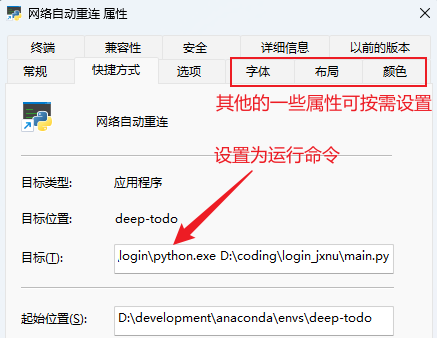

## 江西师大校园网自动重连工具

### 🤔为什么搞这个小工具

校园网不稳定，时常自动断网，如果有远程控制的需求，那么断网是一件很麻烦的事情；虽然windows中有自动连接网络的选项，但有时候不起作用。

### 💡功能

+ 提供便捷的selenium模拟登录方式，不易因校园网升级后请求参数的变化而失效；
+ 自动化的进行网络状态的检测，并在网络中断后自动完成重新连接过程；
+ 除尝试自动连接校园网外，也可以尝试连接wifi列表中的其他可用网络；

### 🔧使用方式

**step1:** 环境安装(python3.9.13)：

```python
git clone https://github.com/try-agaaain/login_jxnu.git
pip install -r requirements.txt
```
**step2:** 安装edgedirver
由于这个工具是使用selenium模拟浏览器进行登录的，所以需要有一个浏览器辅助工具：从设置中找到Edge的版本号(edge://settings/help)，再从[Microsoft Edge WebDriver - Microsoft Edge Developer](https://developer.microsoft.com/en-us/microsoft-edge/tools/webdriver/)找到对应版本的EdgeDriver，并将其路径添加到环境变量中。

**step3:** 在main.py中设置校园网信息：可重连的WIFI列表、学号、校园网密码、运营商、校园网登录地址

```python
# 之前连接过的可用WIFI，例如：["jxnu_stu_123", "4405", "X4408-AI"]，优先尝试列表中靠前的WIFI
wifi_list = ["wifi_name1", "wifi_name2", "wifi_name3"] 
account = "学号"
password = "校园网密码"
domain = "运营商"   # 移动|联通|电信|校园带宽
jxnu_url= "http://172.16.8.8/srun_portal_pc?ac_id=1&theme=pro"  # 校园网登录地址
```

> 这个工具并不具备破解WIFI密码的能力，wifi_list中的WIFI需要是之前连接过的，在第一次连接后系统会缓存WIFI相关信息（密码，WIFI名称等），可以通过`netsh wlan show profile` 查看

**step4:** 运行

```python
python main.py
```

### ⏩快捷方式运行

这个工具没有设计UI界面，每次运行需要输入命令会比较麻烦，有两种便捷方式：

+ 创建快捷方式：在快捷方式的属性中设置运行命令；比如在我的电脑中，通过conda创建的环境中python解释器的路径为`D:\development\anaconda\envs\login\python.exe`，将这个工具放置在了`D:\coding\login_jxnu\main.py`中，可以将快捷方式的目标设置为命令：`D:\development\anaconda\envs\login\python.exe D:\coding\login_jxnu\main.py`，示意图如下：


<div align=center>

</div>

+ bat文件：将上面的命令放在.bat文件中，在windows中双击可直接运行；

### 👨‍🔧Notice

+ 目前只支持windows，网络的连接使用的是windows中的netsh命令完成的，然后再用selenium进行校园网登录；不过改一下连接命令也能用于Linux；
+ 目前在selenium模拟登录的过程中使用的是Edge浏览器，暂时没有去管别的浏览器；如需使用其他浏览器可修改`auto_connect\login.py`中Edge相关的那两行代码；


